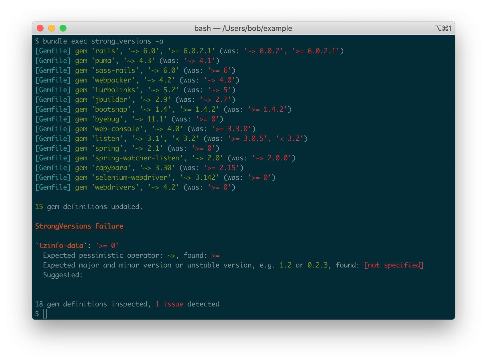

# StrongVersions

```
The right thing to guide us
Is right here inside us
               --Nickelback
```

# Overview

_StrongVersions_ is a _Bundler_ plugin that enforces a strict policy on your `Gemfile` requirements:

* The pessimistic `~>` operator must be used for all gem requirement definitions.
* If the gem version is greater than 1, the requirement format must be `major.minor`, e.g. `'~> 2.5`'
* If the gem version is less than 1, the requirement format must be `major.minor.patch`, e.g. `'~> 0.8.9'`
* An upper bound can be specified as long as a valid pessimistic version is also specified, e.g. `'~> 8.4', '<= 8.4.7'`
* All gems with a `path` source are ignored, e.g. `path: '/path/to/gem'`
* All gems specified in the [ignore list](#ignore) are ignored.

Any gems that do not satisfy these rules will cause `bundle install` to fail and give output detailing which gems did not meet the standard and why.

The benefit of applying this standard is that it [should](https://semver.org/) always be relatively safe to run `bundle update` to upgrade to the latest compatible versions of all dependencies.



## Installation

Add the plugin to your `Gemfile`

```ruby
plugin 'strong_versions', '~> 0.2.0'
```

And rebuild your bundle:

```bash
$ bundle install
```

## Usage

Once the plugin is installed it will automatically hook into _Bundler_ and raise an exception every time you call `bundle install` if there are any errors.

### Exclusions

<a name="ignore"></a>You can exclude any gems from this list by adding them to the `ignore` section of `.strong_versions.yml` in your project root, e.g.:

```yaml
# .strong_versions.yml
ignore:
  - rails
```

### Raise or Warn

_StrongVersions_ can be configured to raise an exception (default) or output a warning when the standard is not met.

Warning instead of raising is especially useful when you want to add new dependencies to your `Gemfile` as you can initially set them with loose requirements and then update the `Gemfile` with more precise values based on your new `Gemfile.lock`.

Set `on_failure` in `.strong_versions.yml` to either `raise` or `warn`:

```yaml
# .strong_versions.yml
on_failure: warn
```

## Contributing

Fork and create a pull request.

Run tests with _RSpec_:

```
$ bin/rspec
```

Check code with _Rubocop_:

```
$ bin/rubocop
```

## License

[MIT License](LICENSE)
